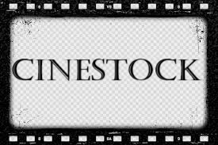

    

     Welcome to CineStock, the ultimate app for movie lovers!

    <strong>Creators:</strong> 
     Martina Proietti 
     Michela Minichini

    <strong>E-mail addresses:</strong> 
     <a href="mailto:martina.proietti2@studio.unibo.it">martina.proietti2@studio.unibo.it</a> 
     <a href="mailto:michela.minichini2@studio.unibo.it">michela.minichini2@studio.unibo.it</a>

### Project for: Laboratorio di Programmazione di Sistemi Mobili 

## Idea
Creating a mobile app to explore, search and purchase your favourite movies quickly and easily.

## What the app can do 
- Explore and Search: Browse a vast collection of movies. Use the search function to easily find your favourite titles. (powered by [TMDB](https://www.themoviedb.org/)).
- Secure Access: Create your account and log in in a few easy steps.
- Buy and Receive: Choose the movie you want, enter your home address, and complete your purchase securely. Your film(s) will be shipped and delivered within 5 business days!
- Share with Friends: Did you find a movie you like? Share it with your contacts directly from the app.

## Features and Future Improvements
- Wishlist: Allow users to create a wish list with movies they would like to purchase in the future
- Reviews and Ratings: Allow users to leave reviews and rate movies they have purchased
- Social Media Integration: Allow users to link their social accounts to share movies and reviews with their friends more easily
- News and Blog Section: Add a section with film news and articles, reviews, interviews with actors and directors
- User Feedback: Implements a system to collect direct feedback from users on the app. This can provide valuable information about what could be improved

## Home Page

## Search Bar
https://github.com/user-attachments/assets/3e7b3092-07d6-458f-bb27-102d87ade9aa

## Sign In

## Film Summary

## Share Film

https://github.com/user-attachments/assets/7c27fb39-ef05-44be-8350-2a6776c00940

## Address 

(!! To be valid, the address must contain the word "street" !!)

## End Page

